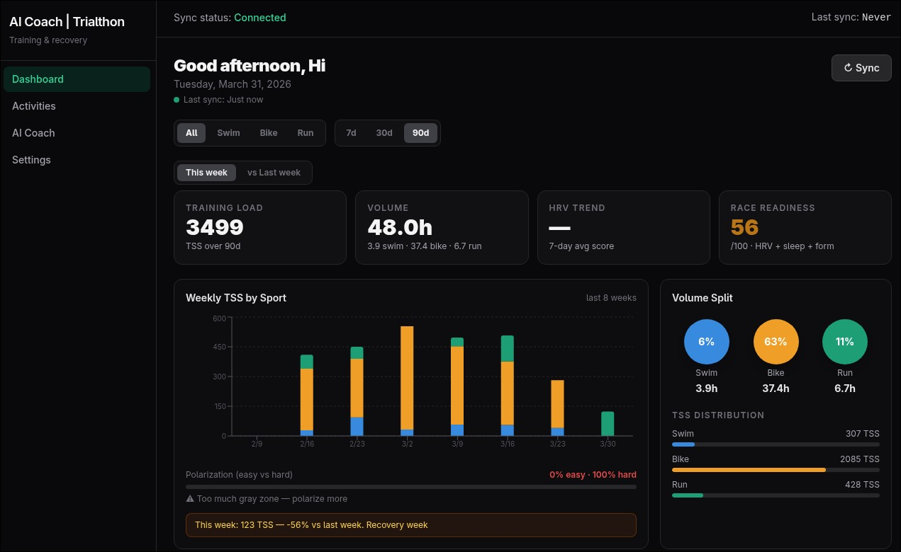
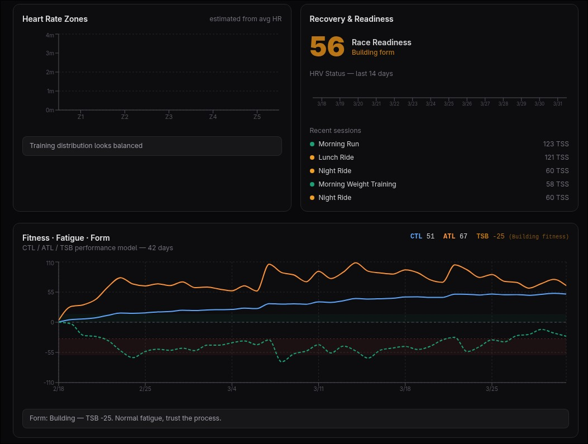
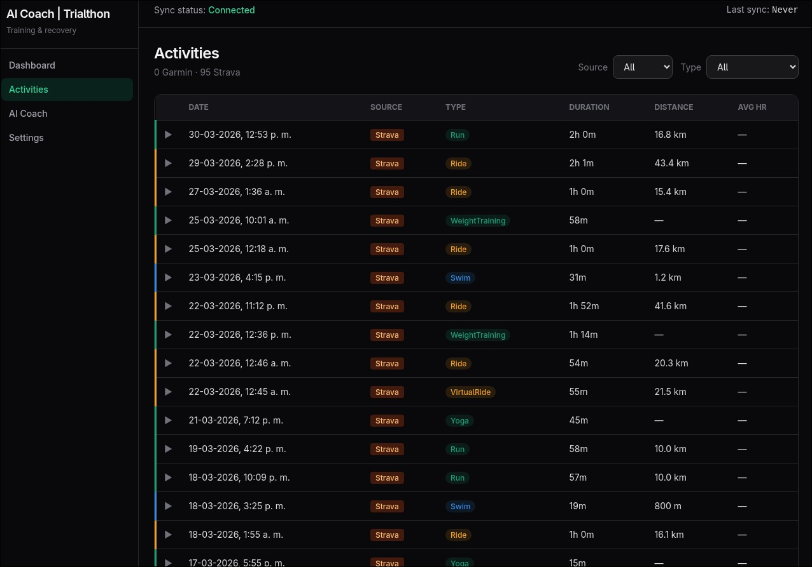
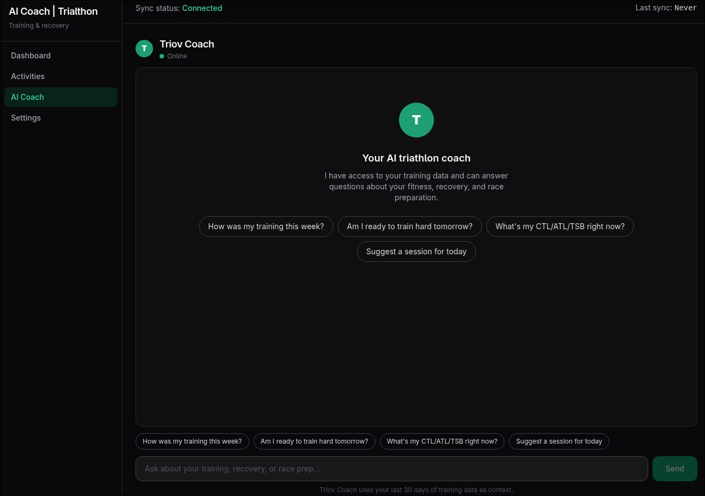
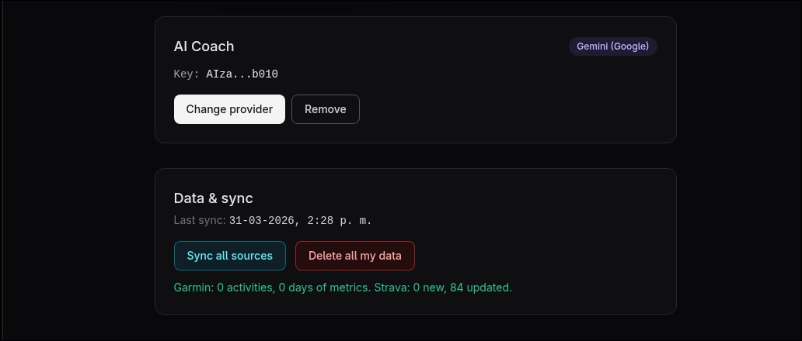

# AI Coach — AI-Powered Endurance Coaching

> AI-powered endurance coaching platform that analyzes athlete data and generates personalized training insights. Sync your Garmin & Strava data, then chat with an AI coach that knows your full training history.

**Status:** Actively developed — production demo deployed.



## Live Demo

| | |
|---|---|
| **Frontend** | https://ai-coach-lac.vercel.app |
| **Backend API** | https://ai-coach-p3dt.onrender.com/docs |

---

## Why This Exists

Built to explore how LLMs can move beyond generic chat and become context-aware coaching systems grounded in real athlete performance data. Most endurance athletes collect large amounts of training data but struggle to transform it into actionable insights — Garmin and Strava show raw numbers but don't tell you *why* you're fatigued or whether you're ready to train hard.

AI Coach solves this by combining structured athlete data (activities, HRV, sleep, CTL/ATL/TSB) with LLM-powered coaching conversations.

---

## Features

- **AI Coach** — Chat with GPT-4o (via OpenRouter) with full context of your last 30–90 days of training load, recovery, and recent workouts.
- **Garmin Import** — Upload CSV exports from Garmin Connect (activities, HRV, sleep, body battery, VO2max).
- **Strava Integration** — OAuth sync with power, pace, and suffer score.
- **Performance Management Chart** — CTL, ATL, TSB (fitness, fatigue, form).
- **HR Zone Distribution** — Weekly breakdown by sport type.
- **Recovery Metrics** — Sleep score, resting HR, HRV status trends.
- **Observability** — Langfuse integration to trace AI calls and monitor performance.

---

## Screenshots

| Dashboard | Activities |
|-----------|------------|
|  |  |

| AI Coach | Sync & Integrations |
|----------|---------------------|
|  |  |

---

## Architecture

```
Next.js 14  ──►  FastAPI  ──►  OpenRouter (GPT-4o)
                    │
               PostgreSQL
                    │
                Langfuse
```

| Layer | Tech |
|-------|------|
| **Frontend** | Next.js 14 (App Router), TypeScript, TailwindCSS → Vercel |
| **Backend** | FastAPI + Uvicorn, SQLAlchemy → Render |
| **Database** | PostgreSQL (Neon) |
| **Auth** | NextAuth v5 — Google OAuth |
| **AI** | OpenRouter — GPT-4o default, swap-ready for Claude/Gemini |
| **Observability** | Langfuse (trace & analytics) |
| **Integrations** | Strava API (OAuth) · Garmin Connect CSV export |
| **Security** | Fernet encryption for tokens, rate limiting via slowapi |

---

## Quick Start

```bash
# Install dependencies and start both servers
npm run dev
```

Starts **FastAPI** on `http://127.0.0.1:8000` and **Next.js** on `http://localhost:3000`.

See [docs/setup.md](docs/setup.md) for full environment variables, manual startup, and deployment guide.

---

## Challenges

- **Context window management** — fitting 30–90 days of meaningful training history into LLM token limits without losing signal
- **Garmin CSV inconsistencies** — parsing locale differences (Spanish/English column names) across export formats
- **Dual OAuth flows** — managing Google + Strava OAuth in a single session model without conflicts
- **AI latency vs UX** — streaming responses while keeping the coaching UI responsive

---

## Lessons Learned

- Designing prompt layers that make LLMs genuinely context-aware, not just generic chatbots
- Building maintainable API boundaries between Next.js and FastAPI across auth, sync, and AI layers
- Balancing shipping velocity against architecture quality in a solo full-stack project
- Managing OAuth token lifecycle for third-party integrations in production
